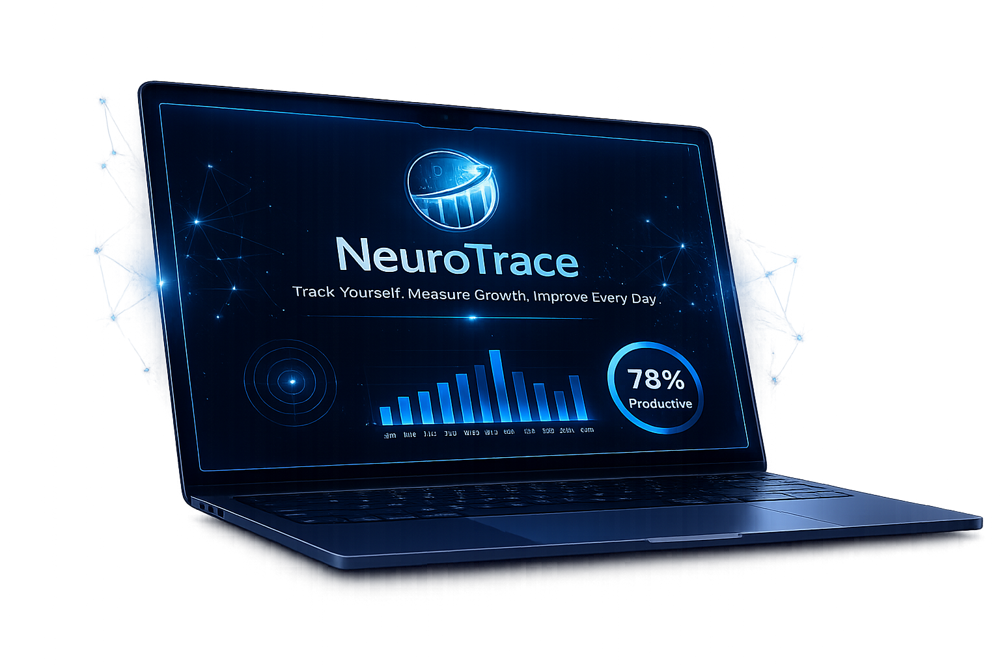

  

##🧠 NeuroTrace — Behavioral Productivity Analytics

NeuroTrace is a real-time behavioral productivity analytics system that tracks browser activity, desktop applications, focus patterns, and productivity behavior.

The platform helps users understand:

* how their time is spent
* which apps and websites consume attention
* productivity vs distraction patterns
* focus consistency and deep work habits

NeuroTrace can also be used as a lightweight activity-monitoring system for behavioral and productivity analysis.

⸻

# 🚀 Live Demo

https://neuro-trace-indol.vercel.app

⸻

✨ Features

⚡ Real-time browser activity tracking
💻 Desktop application monitoring
🧠 Productivity categorization
🕒 Activity timeline with timestamps
🎯 Focus analytics and deep work tracking
🤖 AI-generated behavioral insights
📈 Weekly productivity analytics
📊 Dynamic charts and session monitoring
🔄 Real-time dashboard updates
🌙 Clean modern dashboard UI

⸻

🛠️ Technologies Used

* Next.js
* React
* TypeScript
* Tailwind CSS
* Recharts
* Chrome Extension APIs
* Node.js

⸻

⚙️ How NeuroTrace Works

1. Browser tabs and websites are tracked through the extension
2. Desktop applications are tracked separately through the desktop tracker
3. Activity data is stored locally inside activities.json
4. The dashboard analyzes tracked behavior in real time
5. Productivity insights and analytics are generated dynamically

⸻

## 🚀 Installation

Clone Repository

git clone https://github.com/Chetana12047/NeuroTrace.git

Open Project

cd NeuroTrace

Install Dependencies

npm install

⸻

▶️ Running NeuroTrace

NeuroTrace requires:

* one terminal for the dashboard
* browser extension for tab tracking
* another terminal for desktop app tracking

⸻

Terminal 1 — Start Dashboard

Run:

npm run dev

Dashboard runs at:

http://localhost:3000

This starts:

* dashboard UI
* analytics pages
* charts
* real-time updates

⸻

🌐 Browser Extension Setup

Chrome / Brave / Edge

Open:

chrome://extensions

Then:

1. Enable Developer Mode
2. Click Load Unpacked
3. Select the extension/ folder

The extension will begin tracking:

* browser tabs
* websites visited
* browser activity sessions

⸻

💻 Desktop Activity Tracking

Open another terminal separately for desktop application tracking.

Windows

Run:

node desktop-tracker.js

macOS

Run:

node desktop-tracker.js

This tracks:

* VS Code
* ChatGPT desktop app
* Spotify
* YouTube app
* other active desktop applications

macOS may request:

* Accessibility permissions
* Screen recording permissions

Allow them for proper activity tracking support.

⸻

📄 Pages Included

🏠 Overview
General productivity dashboard and activity summary.

🕒 Activity Timeline
Chronological activity tracking with timestamps and session durations.

🎯 Focus Analytics
Deep work analysis, fragmentation detection, and productive session tracking.

🤖 AI Insights
Behavioral observations and productivity recommendations generated dynamically from user activity.

📈 Weekly Analytics
Weekly focus trends, top platforms, and productivity consistency monitoring.

⸻

# 🧩 Project Structure

NeuroTrace
│
├── app
│   ├── (dashboard)
│   │   ├── focus
│   │   ├── insights
│   │   ├── timeline
│   │   ├── weekly
│   │   ├── layout.tsx
│   │   └── page.tsx
│   │
│   ├── api
│   │   ├── save-activities
│   │   └── save-desktop-activities
│   │
│   ├── globals.css
│   ├── icon.png
│   └── layout.tsx
│
├── components
│   ├── charts
│   │   ├── distraction-chart.tsx
│   │   ├── focus-consistency-chart.tsx
│   │   ├── productive-pie-chart.tsx
│   │   ├── productivity-heatmap.tsx
│   │   ├── realtime-productivity-chart.tsx
│   │   ├── tab-switch-chart.tsx
│   │   ├── weekly-consistency-chart.tsx
│   │   └── weekly-focus-chart.tsx
│   │
│   ├── dashboard
│   │   ├── app-shell.tsx
│   │   ├── nav.tsx
│   │   ├── page-header.tsx
│   │   └── stat-card.tsx
│   │
│   ├── timeline
│   │   └── activity-timeline.tsx
│   │
│   └── ui
│
├── extension
│   ├── background.js
│   ├── manifest.json
│   ├── popup.html
│   └── popup.js
│
├── lib
│   ├── chrome-data.ts
│   ├── data.ts
│   ├── insights-engine.ts
│   ├── system-tracker.ts
│   └── utils.ts
│
├── public
│   └── activities.json
│
├── desktop-tracker.js
├── package.json
└── README.md

⸻

📝 Notes

* Data is stored locally
* No external database is used
* No cloud storage integration
* Analytics are generated directly from tracked activity in real time

⸻

🚀 Future Improvements

* NLP-based behavioral summaries
* Machine learning productivity scoring
* Multi-user analytics
* Authentication system
* Export reports (PDF / CSV)

⸻

### 💡 Why NeuroTrace?

“Productivity is not about working endlessly — it is about understanding where your attention goes.”

NeuroTrace helps users become more aware of their digital habits, distractions, and focus patterns through real-time behavioral analytics.

⸻

👩‍💻 Developer

Developed by Chetana Ingle
